# Dora: Automatic Tourist Route Generator
Dora is a native mobile application that helps the user to plan his day by generating multiple optimized routes automatically with a list of places to visit along with the directions on how to get there with a clear and concise timeline.

## Prerequisites 
* Make sure you enter your Google API key in res/values/strings.xml file.
* If no routes are being generated, there might be a chance that the server is down. In this case, you may find the server code [here](https://github.com/urmichm/route-generation/tree/master/web).

## Installation
To clone this repository, you need to have [GIT](https://git-scm.com) installed on your computer. From your command line:
```
$ git clone https://github.com/sammy9867/dora-route-generation.git
```


## Features
#### User input:
* Select 3 place types (such as cafe, bar and park).
* Setting the priority of the place type by dragging and dropping.
* Setting the frequency of the places to visit. (A higher frequency indicates that the user wants to visit more places but he will spend less time at each place.)
* Setting starting and ending location by either searching a place in the search bar or dropping a pin to the desired location.
* Setting the date and the time slot.

<p align="center">
  
  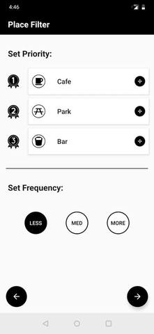 
  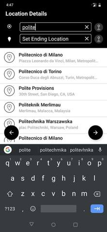
  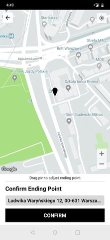                                                
</p>

<p align="center">
  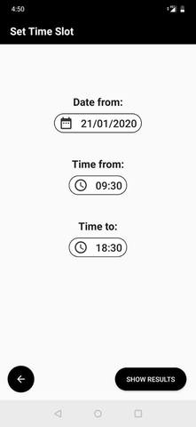
  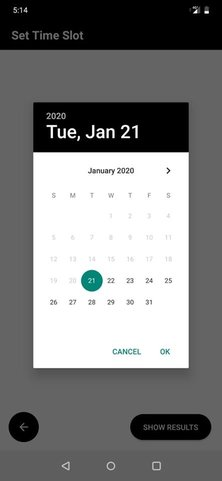 
  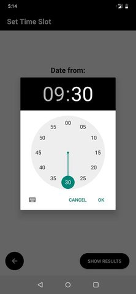                                            
</p>
                                             

#### Result:
* The user can switch between multiple generated routes by clicking on the switch button on the top-left of the map and can edit his preferences by clicking on the filter button on the top-right.
* View clear and concise timeline for the trip in the bottom-sheet view.
* View Place details by clicking on the place type icon on the map.

<p align="center">
  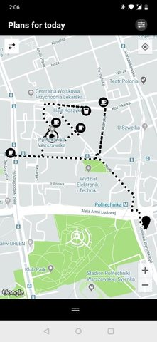
  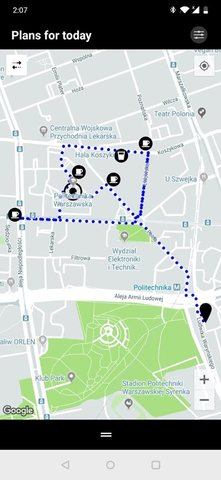 
  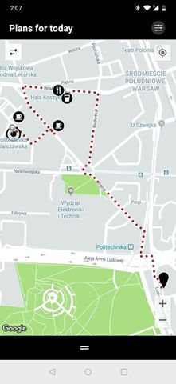                                            
</p>
                                                          
 <p align="center">
  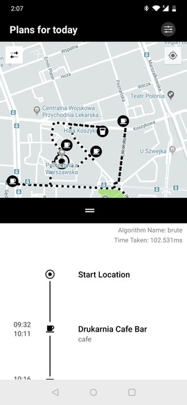
  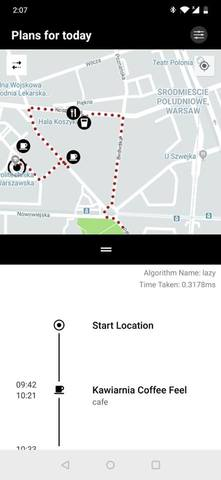 
  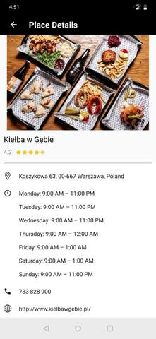                                            
</p>

                                                          

## Built With
* **Navigation component** to navigate between multiple fragments within one activity.
* **Retrofit** to convert HTTP API into a Kotlin interface.
* **Anko Coroutines** for async tasks.
* **AndroidX lifecycle** that provides ViewModel and LiveData classes to build lifecycle-aware
components.
* **Glide** to display images received from the server.
* **Google API's** such as Maps to display google maps, Places to search a place, get place details and  photos and Directions to draw polylines on google maps.

## Contributions
* **Samuel Menezes** -  [@sammy9867](https://github.com/sammy9867): Mobile Application
* **Mikhail Urmich** -  [@urmichm](https://github.com/urmichm): Server
* **Tetyana Sergiyenko** [@sergtan99](https://github.com/sergtan99): Web Application
